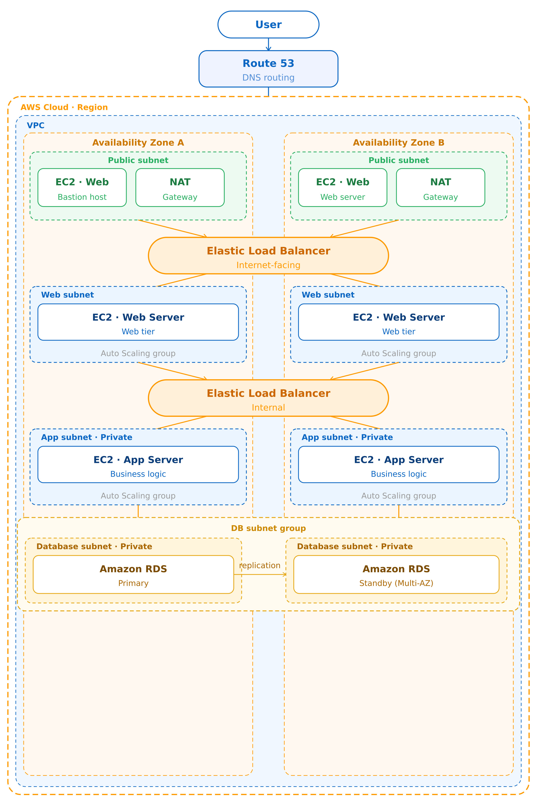

# 🚀 AWS 3-Tier Architecture (Highly Available)

This project demonstrates a **highly available and scalable 3-tier architecture on AWS**, designed using standard cloud architecture principles.

---

## 🧠 Architecture Overview

The system is divided into three layers:

* **Web Tier** – Handles incoming user requests
* **Application Tier** – Processes application logic
* **Database Tier** – Stores application data

The architecture is deployed across **two Availability Zones (Multi-AZ)** to ensure high availability and fault tolerance.

---

## 🌐 Architecture Flow

User → Route 53 → Public Load Balancer → Web Tier → Application Tier → RDS Database

---

## ⚙️ AWS Services Used

* Amazon VPC (Public & Private Subnets)
* Application Load Balancer (ALB)
* Amazon EC2 (Web & Application servers)
* Auto Scaling Groups
* Amazon RDS (Multi-AZ)
* NAT Gateway
* Route 53
* Security Groups

---

## 🔄 Request Flow

1. User sends request via the internet
2. Route 53 resolves the domain and routes traffic
3. Public Load Balancer distributes traffic to Web Tier
4. Web Tier forwards requests to Application Tier
5. Application Tier interacts with the RDS database
6. Response is returned to the user

---

## 🔐 Security Design

* Web Tier is deployed in **public subnets**
* Application and Database tiers are in **private subnets**
* No direct internet access to backend or database
* Security Groups control communication between layers
* NAT Gateway allows secure outbound access from private instances

---

## 📊 Key Features

* High Availability using Multi-AZ deployment
* Auto Scaling for dynamic traffic handling
* Load balancing across instances
* Secure network design with subnet isolation

---

## ⚙️ Implementation Details

* Created a VPC with public and private subnets across 2 Availability Zones
* Configured Internet Gateway and NAT Gateway
* Launched EC2 instances for Web and Application tiers
* Installed and configured required services on EC2 instances
* Created AMIs from configured instances
* Created Launch Templates using the AMIs
* Configured Auto Scaling Groups for both tiers
* Set up Application Load Balancer and target groups
* Deployed Amazon RDS with Multi-AZ configuration
* Configured Security Groups for controlled traffic flow

---

## 📌 Notes

* Infrastructure was provisioned using the AWS Management Console
* Designed based on standard cloud architecture best practices

---
